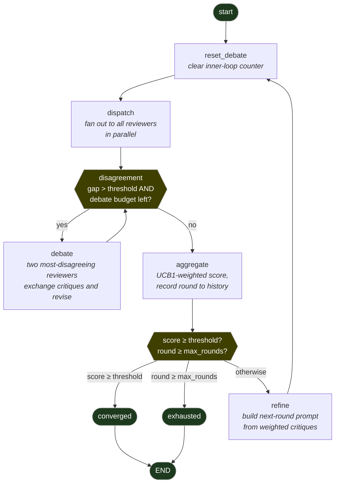

# LLM Consensus — a LangGraph orchestration

A LangGraph state machine drives multiple LLM reviewers through rounds of
parallel review, refining and re-dispatching until consensus is reached. It's
the Python rewrite of an earlier Rust prototype, ported here as a learning
exercise for [LangGraph](https://langchain-ai.github.io/langgraph/) and built
up with three ideas layered on top:

1. A **multi-armed bandit (UCB1)** weights each reviewer's vote by how well
   their past judgements have tracked the room.
2. A **user-preference agent** learns *your* taste from free-text feedback and
   joins every round as an extra reviewer that votes the way you would.
3. A **debate sub-loop** fires when two LLM reviewers disagree sharply — they
   exchange critiques until the gap closes or the debate budget runs out.

> **Lineage.** This project is the Python sibling of an earlier Rust prototype
> (`llm-consensus-rs`). The Rust version proved out the loop; this one adds the
> bandit, the debate sub-loop, the user-preference agent, and the LangGraph
> machinery underneath. Same idea, more concurrency, more observability.

---

## Author vs. reviewer — the role split

There are two different LLM roles in this system. They are easy to conflate:

| Role         | Who                                          | Where it lives                                |
| ------------ | -------------------------------------------- | --------------------------------------------- |
| **Author**   | Whoever wrote the code/plan being reviewed   | Outside the server (typically Claude Code on your laptop) |
| **Reviewer** | The LLMs the server fans out to              | Inside the server, scored in parallel each round  |

The server doesn't know or care who the author was — it just gets a string and
returns a verdict. The reviewer set depends on which keys are set in the
server's `.env`:

| Keys in `.env`                                            | Reviewers active                 |
| --------------------------------------------------------- | -------------------------------- |
| `OPENAI_API_KEY` + `XAI_API_KEY`                          | gpt, grok, *user_pref (dormant)* |
| also `ANTHROPIC_API_KEY`                                  | claude, gpt, grok, user_pref     |
| just one key                                              | one LLM, plus *user_pref (dormant)* |

`user_pref` is *always added* but **abstains gracefully** (returns a neutral
0.5 with no weight) until it has accumulated feedback to learn from.

The disagreement-gap calculation for the debate sub-loop ignores `user_pref`
— debate is between LLM reviewers only.

---

## The graph

The whole system is a single LangGraph state machine. The **outer loop** is
the classic consensus loop (review → score → refine → review again). The
**inner loop** is the debate sub-loop. LangGraph treats both cycles the same:
they are just edges.



### One round, narrated

Assume `OPENAI_API_KEY` + `XAI_API_KEY` are set, so the reviewers are
`{grok, gpt, user_pref}` and `user_pref` is dormant (no feedback yet):

1. **`dispatch`** fans out to all reviewers in parallel. Say grok=0.85, gpt=0.40.
2. **`should_debate?`** Max-min gap on LLMs = 0.45 > 0.10 threshold → `debate`.
3. **`debate`** picks the two extremes (grok, gpt), sends each the other's
   critique, and asks them to revise or stand firm. Each returns a new score.
4. **Loop back to `should_debate?`** with new scores. If the gap is now below
   threshold *or* the debate budget is exhausted, fall through to `aggregate`.
5. **`aggregate`** computes a **UCB1-weighted** average and updates the bandit
   stats: reviewers whose score was close to the aggregate gain reward.
6. **`decide_route`** checks the aggregate. ≥ threshold → `converged` → END.
   Else, max_rounds reached → `exhausted` → END. Else → `refine`.
7. **`refine`** appends the round's critique block to `current_output` so the
   next round's reviewers see what was flagged. Loop back to step 1.

---

## Why these pieces?

### LangGraph

Instead of one big `while score < 0.95` loop, every step is a **node** (a
plain async function) and the transitions are **edges**. LangGraph handles:

- **State threading.** A single `ConsensusState` dict flows through every
  node. Each node returns a partial update; LangGraph merges them. List fields
  use `Annotated[..., operator.add]` so updates *append* instead of *replace*.
- **Branching & cycles.** Conditional edges return the name of the next node;
  both the debate sub-loop and the main consensus loop are expressed as edges.
- **Streaming.** `graph.astream(state, stream_mode="updates")` yields one
  event per node — forwarded over SSE to the dashboard so you can watch the
  consensus form in real time.

### UCB1 — multi-armed bandit, in one paragraph

You have *N* slot machines (here: *N* reviewer LLMs) and you want to maximize
total payout (here: agreement with the eventual group consensus). UCB1 ("Upper
Confidence Bound, 1") gives each machine a score:

    UCB(arm) = mean_reward + sqrt( 2 · ln(total_pulls) / pulls_of_this_arm )

The first term is what you'd pick if you only cared about exploitation. The
second is the **exploration bonus**: rarely-pulled arms get a boost so the
algorithm doesn't lock onto early winners and miss late-blooming ones. As
pulls accumulate the bonus shrinks. Each round we recompute scores and
normalise them into weights that sum to 1, then use those weights when
averaging the reviewers.

The reward signal we feed back in each round is:

    reward = 1 - | reviewer_score - aggregated_score |

so reviewers whose verdicts track the room earn reward; outliers lose ground.
Cold start (round 1, no pulls) → uniform weights. After that the system
learns online which reviewers are reliable on *this kind of task*, with no
manual calibration.

### Debate sub-loop

Two LLMs disagreeing by 40 points is more often "one of them is wrong" than
"there are two valid views." When the highest and lowest LLM scores differ by
more than `disagreement_threshold` (default 0.10), the **debate** node sends
each side the other's critique and asks them to either *revise* (justify
what they missed) or *stand firm* (refute the opposing point). Up to
`max_debate_rounds` iterations (default 2). User_pref doesn't debate — it
channels you, not a negotiable position.

### User-preference agent

The hardest reviewer to add to any consensus system is **you**. The
`UserPreferenceReviewer` solves this with two pieces:

1. A **persistent preference store** (`data/preferences.json`) — each time you
   submit free-text feedback via `POST /feedback`, a record is appended.
2. A **predictor** — Claude is asked, with your past feedback as few-shot
   examples, to predict the score and critique *you* would give.

With zero records it abstains. As records accumulate it gets sharper. The
bandit then learns which LLM reviewers tend to vote like you and weights them
accordingly — your taste propagates through the system without you needing to
review every round.

---

## Quick start

```bash
# Install (uses uv)
uv sync

# Configure
cp .env.example .env
# Edit .env: set at least one of ANTHROPIC_API_KEY / OPENAI_API_KEY / XAI_API_KEY

# Run
uv run llm-consensus
# → http://127.0.0.1:3000/dashboard
```

Submit work for review:

```bash
curl -X POST http://localhost:3000/consensus \
  -H "Content-Type: application/json" \
  -d '{
    "task": "Review this rate limiter",
    "phase": "code",
    "current_output": "def limit(req): ...",
    "threshold": 0.95,
    "max_rounds": 5
  }'
```

Teach the user-preference agent:

```bash
curl -X POST http://localhost:3000/feedback \
  -H "Content-Type: application/json" \
  -d '{
    "session_id": "...",
    "round": 3,
    "output_snippet": "def limit(req): ...",
    "comment": "Too verbose. I prefer no docstrings on one-line helpers."
  }'
```

---

## Demo (no API keys required)

A self-contained demo using **scripted reviewers** lets you watch the loop
without configuring any LLM provider. Two reviewers are tuned to disagree on
round 1 (triggering the debate sub-loop), converge by round ~4.

```bash
# CLI: prints each node event to stdout, colour-coded
uv run llm-consensus-demo

# Live dashboard on port 3001 (kept distinct from main server on 3000)
uv run llm-consensus-demo --dashboard
# → http://localhost:3001/dashboard  (click "Run Consensus")
```

What you'll see in CLI mode (abridged):

```
── Round 1 ── dispatch
    grok  0.85  Looks fine — division is straightforward.
     gpt  0.40  No input validation, no zero-division guard. Will crash.

  debate round 1 — exchanging critiques
      grok  0.72  Fair point on zero-division. Conceding partially.
       gpt  0.55  Holding firm — division by zero is a real bug.

  debate round 2 — exchanging critiques
      grok  0.68  Type hints would help, but core logic is OK.
       gpt  0.62  Acceptable compromise. Types still missing.
  aggregate: weighted score = 0.650   weights: grok=0.50  gpt=0.50

── Round 2 ── dispatch
    grok  0.88  Guard added — good. Docstring still thin.
     gpt  0.78  Type hints added, division guarded. Better.
  aggregate: weighted score = 0.830

── Round 3 ── dispatch  ...  weighted score = 0.940
── Round 4 ── dispatch  ...  weighted score = 0.965

CONVERGED — threshold_met
```

The demo uses the **real graph and real nodes** — only the reviewer HTTP
calls are replaced. It's the cleanest end-to-end illustration of the system.

---

## Wiring this into Claude Code (or any other agent)

This repo ships a `CLAUDE_CONSENSUS_GUIDE.md` — drop-in operational
instructions for an LLM-driven agent (Claude Code, an MCP client, whatever)
that tell it *when* to call the server, *what* to send, and *how* to display
the results back to the user. Point your agent at it by either:

- Adding to your project's `CLAUDE.md`:
  ```
  Read CLAUDE_CONSENSUS_GUIDE.md and follow its workflow for non-trivial tasks.
  ```
- Or just copying `CLAUDE_CONSENSUS_GUIDE.md` into the project you want
  reviewed.

The guide covers session-ID conventions, when to seek consensus vs skip it,
how to surface debate-loop activity, and how to handle exhaustion.

---

## API

| Endpoint                   | Description                                             |
| -------------------------- | ------------------------------------------------------- |
| `POST /consensus`          | Run consensus to completion, return the final state.    |
| `POST /consensus/stream`   | Same, but stream every node update as SSE.              |
| `POST /feedback`           | Append a free-text feedback record for `user_pref`.     |
| `GET  /dashboard`          | Minimal HTML live monitor.                              |
| `GET  /health`             | Health + count of stored feedback records.              |

Request body (`POST /consensus`):

```json
{
  "task": "<what you want reviewed>",
  "phase": "plan | code | review",
  "current_output": "<the string under review>",
  "threshold": 0.95,
  "max_rounds": 10,
  "max_debate_rounds": 2,
  "disagreement_threshold": 0.10,
  "session_id": "<optional UUID>"
}
```

---

## Project layout

```
src/llm_consensus/
├── state.py              # ConsensusState TypedDict + pydantic value types
├── agents.py             # Claude / GPT / Grok HTTP clients (Reviewer protocol)
├── user_reviewer.py      # UserPreferenceReviewer — votes the way you vote
├── preferences.py        # JSON-backed preference store
├── policy/
│   └── bandit.py         # UCB1 implementation (3 small functions)
├── nodes/
│   ├── dispatch.py       # parallel fan-out to every reviewer
│   ├── debate.py         # disagreement sub-loop
│   ├── aggregate.py      # weighted scoring + history append
│   ├── decide.py         # conditional edge: converged / exhausted / refine
│   └── refine.py         # build next-round prompt from critiques
├── graph.py              # LangGraph wiring (the diagram above)
├── server.py             # FastAPI + SSE
├── demo.py               # scripted-reviewer demo, CLI + dashboard
└── dashboard/index.html  # minimal live UI

tests/                    # 17 tests, all offline (FakeReviewer)
```

---

## Tests

```bash
uv run pytest -q       # 17 tests, all offline, ~100ms
```

The suite uses a `FakeReviewer` (`tests/conftest.py`) with scripted scores so
nothing hits a real LLM. Coverage:

| File              | Tests | Covers                                          |
| ----------------- | ----- | ----------------------------------------------- |
| `test_bandit.py`  | 5     | UCB1 math, cold-start, reward updates           |
| `test_nodes.py`   | 8     | dispatch fan-out, aggregate weighting, `should_debate` triggers, `decide_route` |
| `test_graph.py`   | 4     | end-to-end through the LangGraph: converges, debates-then-converges, exhausts, history recording |

LLMs are non-deterministic, so we deliberately **mock at the boundary** and
test the orchestration. The demo (`uv run llm-consensus-demo`) plays the same
role for humans: scripted inputs, real graph, see exactly what happens.

---

## License

MIT
